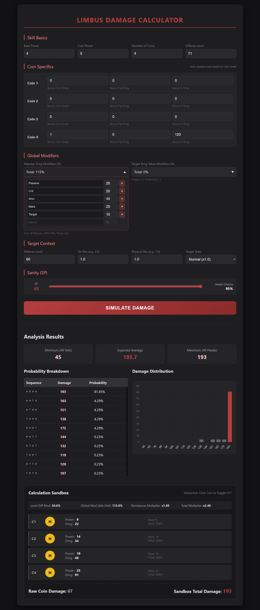

# Limbus Company Damage Calculation Guide

This document outlines the standard damage formula used in Limbus Company, specifically distinguishing between **Static** and **Dynamic** modifier pools.

## 1. The Core Formula

Damage is calculated by multiplying the Skill Power by two distinct additive pools, flooring the result, and finally adding any flat damage bonuses.

$$Damage = \lfloor (Power \times StaticMultiplier \times DynamicMultiplier) \rfloor + FlatDamage$$

---

## 2. The Static Multiplier Pool

**Calculation:** $1 + \sum(\text{Static Modifiers})$

The Static pool represents modifiers inherent to the matchup (levels and resistances) or the specific hit condition (criticals). Modifiers within this pool are **additive**.

| Modifier            | Formula / Value                        | Notes                                              |
| :------------------ | :------------------------------------- | :------------------------------------------------- |
| **Sin Resistance**  | $(ResValue - 1)$                       | e.g., Fatal (2.0) = $+1.0$; Endured (0.5) = $-0.5$ |
| **Phys Resistance** | $(ResValue - 1)$                       | Staggering an enemy sets this to $2.0$ ($+1.0$)    |
| **Level Modifier**  | $\frac{Off - Def}{\|Off - Def\| + 25}$ | Approximates $\pm 3\%$ per level difference.       |
| **Critical Hit**    | $+0.2$                                 | Fixed 20% bonus added to the static pool.          |
| **Clash Bonus**     | $+0.03 \times n$                       | $+3\%$ per clash won ($n$) in the current chain.   |

**Example:** If hitting a Weakness (2.0), with a +5 Level Advantage (+0.15), and a Crit (+0.2):
_Static Multiplier_ $= 1 + (2.0 - 1) + 0.15 + 0.2 = \mathbf{2.35x}$

---

## 3. The Dynamic Multiplier Pool

**Calculation:** $1 + \sum(\text{Dynamic Modifiers})$

The Dynamic pool consists of status effects, passives, and temporary buffs. Like the static pool, these are **additive with each other** but multiplicative against the static pool.

| Modifier       | Type     | Common Value                                     |
| :------------- | :------- | :----------------------------------------------- |
| **Fragile**    | Debuff   | $+0.1$ ($10\%$) per stack                        |
| **Damage Up**  | Buff     | $+0.1$ ($10\%$) per stack                        |
| **Protection** | Buff     | $-0.1$ ($-10\%$) per stack                       |
| **Passives**   | Skill/ID | e.g., "Deal $+20\%$ damage if HP > 50%" = $+0.2$ |

**Example:** If you have 2 Fragile stacks (+0.2) and a Passive for +10% damage (+0.1):
_Dynamic Multiplier_ $= 1 + 0.2 + 0.1 = \mathbf{1.3x}$

---

## 4. Final Calculation Example

**Scenario:**

- **Power:** 20
- **Static:** 2.35x (from example above)
- **Dynamic:** 1.3x (from example above)
- **Flat Damage:** 5

**Result:**

1. $20 \times 2.35 \times 1.3 = 61.1$
2. $\lfloor 61.1 \rfloor = 61$
3. $61 + 5 = \mathbf{66 \text{ Total Damage}}$

---

## 5. Implementation Notes for Developers

- **Flooring:** Always floor _after_ multiplying both pools but _before_ adding flat damage.
- **Minimum Damage:** In-game damage cannot fall below **1** (unless a shield absorbs it).
- **Exceptions:** A few specific buffs (like _Swordplay of the Homeland_) may act as independent multiplicative layers or total damage overrides.
